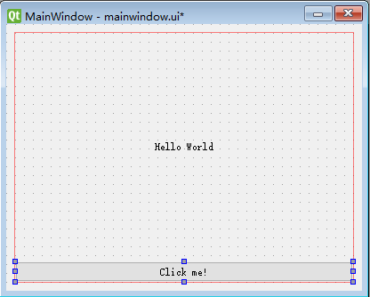
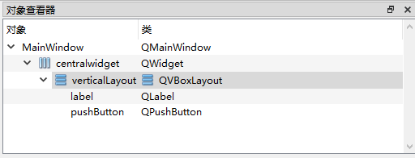
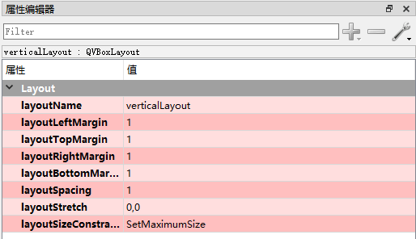
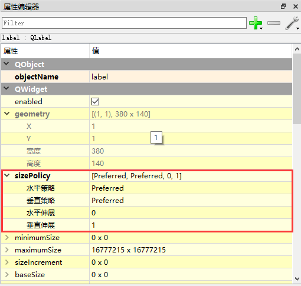
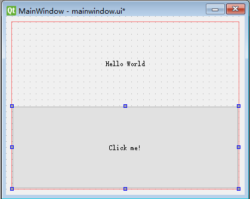

#布局  
在Qt中，提供了多种布局，我们常用的是两种：水平和垂直。为什么要使用布局？有些人可能遇到过，
窗口绘制好后，运行时偶然拖动窗口或控件位置大小，会破坏整个布局的美观。在Qt中使用布局功能，
能很好的控制控件的大小和位置随窗孔变化而变化。
##绘制Lesson_1窗口  
打开QtDesigner，新建一个空白窗口，在主窗口中放置一个垂直布局，然后在主窗口空白处单击鼠标右键，任意选择一
种布局。此时放置的垂直布局框会布满主窗口。然后在该布局中放置一个Label和一个Push Button，他们会自动上下分布。
（Qt中一般使用Label来显示文字和图像）然后修改Label的文字对齐属性为居中。主程序中，要注意窗口控件所属关系，
否则使用“.”方式调用会出现问题。到此处程序能正常执行的话，你就得到了与Lesson_1相同的窗口。
  
##布局参数  
上面窗口的绘制使用了默认参数，美观的布局依赖于参数的设置。
一个布局的属性有两部分，自己与别人的关系和自己内部的关系。
在QtDesigner中，默认情况下，右上角是对象查看器。  
  
在对象查看器中，我们可以很方便的选中控件，也可以看出所属关系。选中
QVBoxLayout，下方出现属性编辑器。  
  
这部分属性是设置该布局与相邻布局的距离的，即自己与别人关系。
在对象查看器中，选中布局下的某一个控件，然后找到“水平伸展”和“垂直伸展”两个属性，他们的数值表示了当前布局中
不同控件大小所占的比例，即自己内部关系。  
  
当前是QVBoxLayout，因此只考虑垂直比例，如果我们将比例设置为1：1，
即将label的“垂直伸展”和pushButton的“垂直伸展”都设置为1，那么在窗口变化中，上下两个控件垂直高度会一样。
（当使用动态布局，切记分布策略选择“preferred"）

