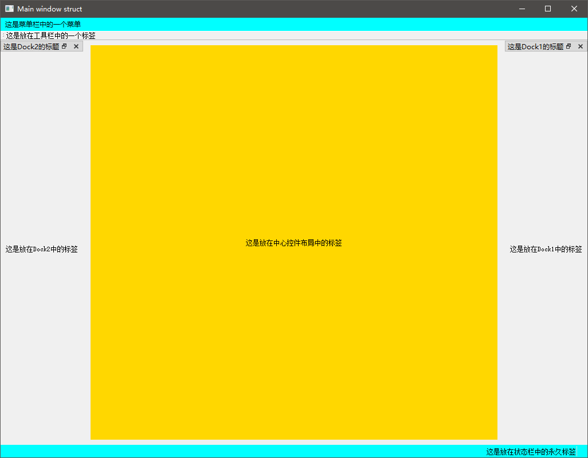
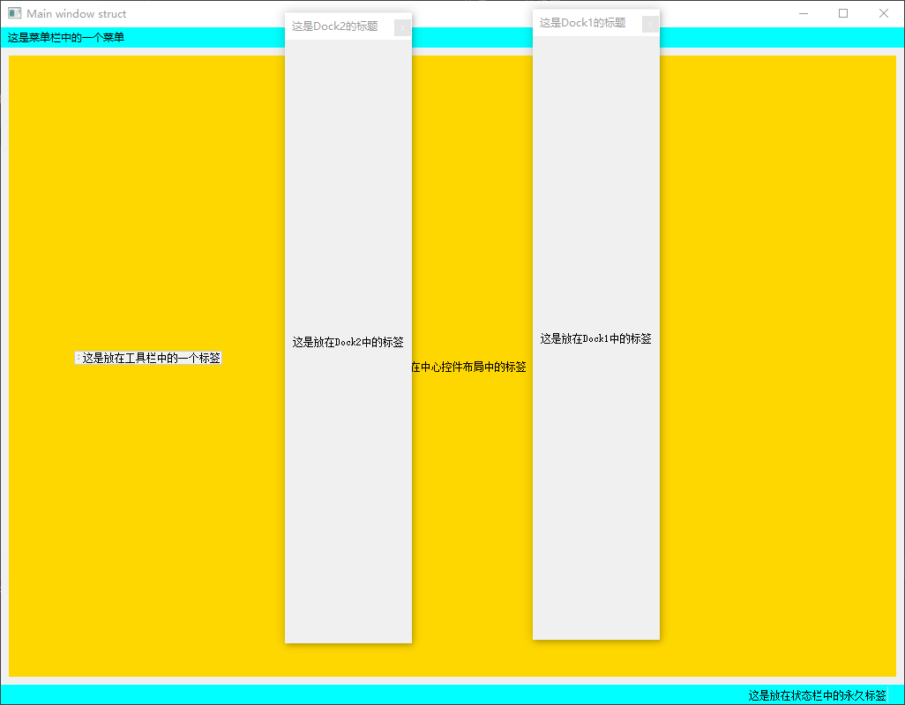

# 主窗口构成  
   
   

* 上图是窗口初始化截图，下图是将dock控件浮动后的截图。
* 从上例分析得知主窗口构成：窗口从上往下由菜单栏，中心区域和状态栏构成。

### 中心区域 
* 中心区域可以任意布置控件的区域，主要由中心控件，dock窗口，工具栏组成。    
* 之前使用QtDesigner的例子，当新建一个窗口时，相当于创建一个窗口包含菜单栏，
中心区域和状态栏，然后在中心区域放入一个中心控件。我们的操作都是在这个中心
控件上部署的。  
* 只有主窗口可以添加中心控件，工具栏和dock控件。  

### 最后  
* 熟悉掌握窗口的结构，以后控件部署会有条不紊。
* 下一讲([第八课]())会介绍多窗口的继承和嵌套。